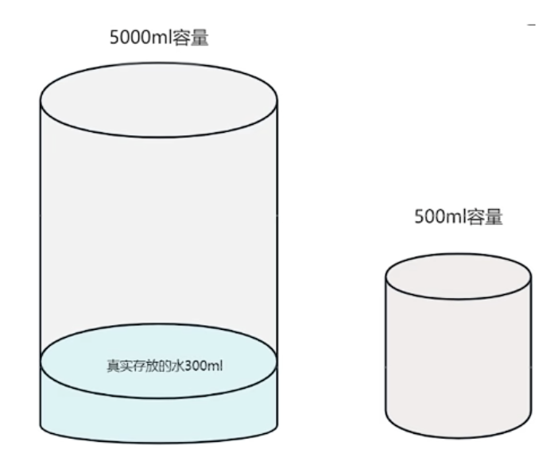

- #Java #整数类型
- 整数类型字面量的四种表示形式
	- 1、十进制表示法：以数字0-9组成的常数，默认为十进制表示法。
	- 例如：int a = 10;
	- 2、二进制表示法：以0b或0B开头的常数，由0和1组合而成。
	- 例如：int b = 0b101;
	- 3、八进制表示法：以0开头的常数，由数字0-7组成。
	- 例如：int c = 012;
	- 4、十六进制表示法：以0x或0X开头的常数，由0-9和A-F（大小写均可）组成。
- 整数型字面量默认当做int处理
	- Java中整数型字面量默认被当做int类型来处理，如果要表示long类型的整数，需要在字面量后面加上’L’或‘|标记。例如， 下面是表示int和long类型整数的字面量的示例：
	- int x = 10；// 10是一个int类型的字面量
	- long y = 10L；// 10L是一个long类型的字面量
	- 需要注意的是，大小写字母 L 和 l 的使用没有区别，但是容易被误解为数字1，因此建议使用大写字母。
- 请看以下代码有什么问题吗?
	- long z = 2147483648；
	- 编译报错，原因是2147483648被当做int类型处理，而该数字本身已经超出了int最大值，如何修改？
	- long z = 2147483648L；
- 自动类型转换
	- 在Java中，对于基本数据类型来说，小容量是可以直接赋值给大容量的，这被称为自动类型转换。对于数字类型来说大
	- 小关系为：byte < short < int < long< float < double
- 强制类型转换
	- Java中大容量是无法直接转换成小容量的。因为这种操作可能会导致精度损失，所以这种行为交给了程序员来决定，当然这种后果自然是程序员自己去承担。因此在代码中需要程序员自己亲手加上强制类型转换符，程序才能编译通过
	- 强制类型转换时，底层二进制是如何变化的？原则：砍掉左侧多余的二进制。
	- 强制类型转换时，精度可能会损失，也可能不会损失，这要看具体的数据是否真正的超出了强转后的类型的取值范围。如下图：水可能溢出，也可能不会溢出，这要看真实存放的水有多少
	- 请推算结果：byte b = （byte）150；
- 
- - https://github.com/27Aaron/Learning-Programming/tree/main/Java/P36